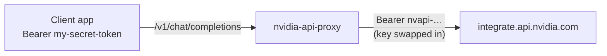

<div align="center">

# nvidia-api-proxy

*Put your NVIDIA API key behind a token you control*

[](https://nodejs.org)
[](package.json)
[](server.test.js)

[Features](#features) • [Quick start](#quick-start) • [Configuration](#configuration) • [Endpoints](#endpoints) • [Deploy](#deploy-to-render)

</div>

A zero-dependency Node.js reverse proxy for the [NVIDIA NIM API](https://docs.api.nvidia.com/).
Client apps call the proxy exactly like `https://integrate.api.nvidia.com/v1` — same paths, same
bodies — but authenticate with **your** token. The real key stays server-side, never shipped to clients.



## Features

- 🎯 **Transparent drop-in** — point clients at the proxy, keep every path, query, and body byte-identical
- 🔑 **Key isolation** — clients send `PROXY_AUTH_TOKEN`, the proxy swaps in the real `NVIDIA_API_KEY` upstream
- ⚡ **Streaming first** — SSE responses pass through unbuffered, chunk by chunk
- 📨 **Header fidelity** — multi-value `set-cookie` preserved, hop-by-hop headers stripped both ways
- 🛡️ **Constant-time auth** — token comparison via `timingSafeEqual`, no timing side channels
- 🚀 **Deploy ready** — Render config included, graceful SIGTERM shutdown for zero-downtime deploys
- 📦 **Zero dependencies** — Node.js built-ins only (Node >= 18.14)

## Quick start

```bash
git clone https://github.com/ak-a-ra/nvidia-api-proxy
cd nvidia-api-proxy

export NVIDIA_API_KEY="nvapi-..."          # your real NVIDIA key
export PROXY_AUTH_TOKEN="my-secret-token"  # token your clients will use
export NVIDIA_BASE_URL="https://integrate.api.nvidia.com/v1"

npm start
```

Call it like the NVIDIA API, with your own token:

```bash
curl http://localhost:10000/v1/chat/completions \
  -H "Authorization: Bearer my-secret-token" \
  -H "Content-Type: application/json" \
  -d '{"model": "meta/llama-3.1-8b-instruct", "messages": [{"role": "user", "content": "hi"}]}'
```

Any OpenAI-compatible client works the same way — just set the base URL to your proxy and use
`PROXY_AUTH_TOKEN` as the API key:

```js
import OpenAI from "openai";

const client = new OpenAI({
  baseURL: "https://your-proxy.example.com/v1",
  apiKey: "my-secret-token", // your PROXY_AUTH_TOKEN, not the NVIDIA key
});
```

> [!TIP]
> Run the test suite (28 tests, no deps needed):
> ```bash
> npm test
> ```

## Configuration

| Env var             | Required | Purpose                                                      |
| ------------------- | -------- | ------------------------------------------------------------ |
| `NVIDIA_API_KEY`    | yes      | Real NVIDIA key, sent upstream as `Bearer <key>`              |
| `PROXY_AUTH_TOKEN`  | yes      | Token clients must send as `Authorization: Bearer <token>`    |
| `NVIDIA_BASE_URL`   | yes      | Upstream base URL, e.g. `https://integrate.api.nvidia.com/v1` |
| `PORT`              | no       | Listen port (default `10000`, binds `0.0.0.0`)                |
| `UPSTREAM_CONNECT_TIMEOUT_SECONDS` | no | Seconds to wait for upstream response headers (default `30`, `0` disables) |
| `UPSTREAM_IDLE_TIMEOUT_SECONDS`    | no | Seconds a response stream may stay silent before it is cut (default `120`, `0` disables; resets on every chunk) |

Copy-paste-ready local setup — fill in the two values marked `FIXME`:

```bash
# ---- required ----
export NVIDIA_API_KEY="FIXME"    # your real NVIDIA key (nvapi-...)
export PROXY_AUTH_TOKEN="FIXME"  # token your clients will send
# ---- optional (defaults shown; uncomment to override) ----
# export NVIDIA_BASE_URL="https://integrate.api.nvidia.com/v1"  # pinned by render.yaml
# export PORT="10000"
# export UPSTREAM_CONNECT_TIMEOUT_SECONDS="30"  # 0 disables
# export UPSTREAM_IDLE_TIMEOUT_SECONDS="120"    # 0 disables; resets on every chunk

npm start
```

> [!NOTE]
> With missing required vars, `/health` returns `503 { status: "unconfigured" }` and proxied calls
> return `503`. If `NVIDIA_BASE_URL` is unset or not a valid URL at startup, the process exits with
> code 1.

## Endpoints

| Route         | Behavior                                                                              |
| ------------- | ------------------------------------------------------------------------------------- |
| `GET /health` | `200 { status: "ok" }` when configured, `503 { status: "unconfigured" }` otherwise     |
| `ANY /v1/*`   | Proxied to upstream; requires `Authorization: Bearer <PROXY_AUTH_TOKEN>`               |
| bare `/v1` or `/v1/` | `404 { error: "Not found" }` — the proxy forwards `/v1/*` paths, not the `/v1` prefix itself |
| anything else | `404 { error: "Not found" }`                                                          |

### Path mapping

The proxy forwards the incoming path verbatim onto the base URL's host — the `/v1` a client
sends is the one the upstream sees. Any correctly-shaped base works, with or without a
trailing `/v1`:

```
client:   /v1/chat/completions?stream=true
base:     https://integrate.api.nvidia.com/v1
upstream: https://integrate.api.nvidia.com/v1/chat/completions?stream=true

client:   /v1/models
base:     https://integrate.api.nvidia.com        (origin-only works too)
upstream: https://integrate.api.nvidia.com/v1/models
```

Error responses never leak internal details (DNS names, URLs) — upstream failures return a clean
`502 { error: "Bad gateway" }`.

## Deploy to Render

The repo ships with `render.yaml` (free plan, health check on `/health`):

```bash
render blueprint launch
```

Set `NVIDIA_API_KEY` and `PROXY_AUTH_TOKEN` as secret environment variables when prompted.

> [!WARNING]
> Anyone holding `PROXY_AUTH_TOKEN` can spend your NVIDIA quota. Use a long random token and share
> it only with clients you trust.
